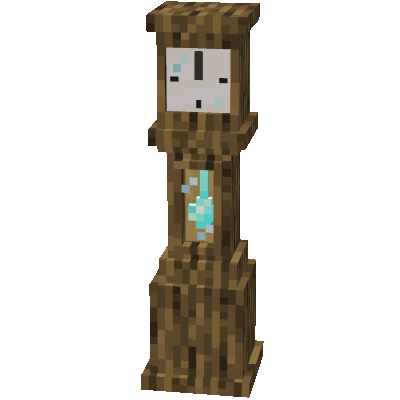

 

    

<h1 style="text-align: center;">
    
    
    
</h1>

<h1 style="text-align: center;">Colourful Clocks</h1>

Tell time in style with Pocket Watches and Customizable Grandfather Clocks! Mix and match 
Wood Types, Glass Colours, Clock Hands, and Pendulums to create the perfect decoration for your world!

## Pocket Watch
A must-have for any adventurer with a keen sense of style, this handheld clock doubles as the power source for 
Grandfather Clocks. Can be placed in any Bornholm Dial.

**Types:** Iron, Copper, Exposed Copper, Weathered Copper, Oxidized Copper, Gold, Diamond, Netherite

**Note:** Exposed, Weathered, and Oxidized Copper Pocket Watches cannot be crafted. They oxidize when in hand and can be 
waxed to preserve the condition.

****

## Bornholm Grandfather Clock
Clocks come in 3 parts: Base, Trunk, and Dial.
A clock will only function if all 3 pieces are placed together. The Hour hand will be at the top (12) at noon and midnight. 
This version is styled after Danish Bornholm clocks.

**Details**   
- Each Pendulum has a different swing speed, Iron the fastest, Netherite the slowest.
- Glass types are changed using Stained Glass Panes. Wood can also be used on doors to remove the glass.

### Customization Options
**Wood Types:** Oak, Spruce, Birch, Jungle, Acacia, Dark Oak, Mangrove, Cherry, Bamboo, Crimson, Warped   
**Dial Glass:** Clear, White, Orange, Magenta, Light Blue, Yellow, Lime, Pink, Gray, Light Gray, Cyan, Purple, Blue, Brown, Green, Red, Black   
**Glass Door Types:** Clear, White, Orange, Magenta, Light Blue, Yellow, Lime, Pink, Gray, Light Gray, Cyan, Purple, Blue, Brown, Green, Red, Black   
**Clock Hands:** Iron, Copper, Gold, Diamond, Netherite   
**Pendulums:** Iron, Copper, Exposed Copper, Weathered Copper, Oxidized Copper, Gold, Diamond, Netherite

**Note:** Exposed, Weathered, and Oxidized Copper Pendulums cannot be crafted. They oxidize when hanging in active clocks and can 
be waxed to preserve the condition.

****

### Recipe's

****

### To Implement

- Dong sound at 12, change pitch based on pendulum
- Time Effects (Area of efffect determined by clock hands)
  - Increase Crop Growth
  - Increase Animal Ageing