 

    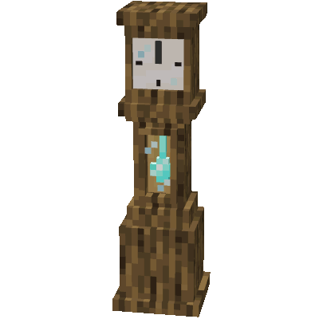

<h1 style="text-align: center;">
    
    
    
</h1>

<h1 style="text-align: center;">Colourful Clocks</h1>

Tell time in style with Pocket Watches and **five** clock designs! Mix and match Material Types, Glass Colours, Clock Hands, Pendulums, and Handbells to create the perfect decoration for your world!

There are ___ advancements to guide players in game.

***

## Clock Types

Each clock can be made from 41 different materials. With options to customize; Clock Hands, Pendulums, Handbells, and Glass if the clock can accept them. Clocks can also make a ticking sound.

### Customization Options

| Clock          | Glass | Pocket Watch | Pendulum | Handbell |
|----------------|-------|--------------|----------|----------|
| Bornholm Dial  | x     | x            |          |          |
| Bornholm Trunk | x     |              | x        |          |
| Alarm          | x     | x            |          | x        |
| Mantel         | x     | x            |          |          |
| Tall Mantel    | x     | x            | x        |          |
| Wall           |       | x            |          |          |

**Clock Types:** Oak, Spruce, Birch, Jungle, Acacia, Dark Oak, Mangrove, Cherry, Bamboo, Crimson, Warped, Stripped Oak, Stripped Spruce, Stripped Birch, Stripped Jungle, Stripped Acacia, Stripped Dark Oak, Stripped Mangrove,
Stripped Cherry, Stripped Bamboo, Stripped Crimson, Stripped Warped, Stone Bricks, Mossy Stone Bricks, Polished Granite, Polished Diorite, Polished Andesite, Polished Deepslate, Deepslate Bricks, Polished Tuff, Tuff Bricks, Bricks, Mud Bricks, Cut Sandstone, Cut Red Sandstone, Prismarine Bricks, Dark Prismarine, Nether Bricks, Red Nether Bricks, Polished Blackstone, Polished Blackstone Bricks
**Glass Types:** Clear, White, Orange, Magenta, Light Blue, Yellow, Lime, Pink, Gray, Light Gray, Cyan, Purple, Blue, Brown, Green, Red, Black
**Ticking:** Clocks can also make a ticking sound when a Pocket Watch is present and the clock is activated(Bornholm fully assembled). Right-click with redstone to enable, right-click with a Pickaxe to disable.

**Notes:**
- A tool with Silk Touch can be used to retain the Pocket Watch, Pendulum, Handbell, or Glass Type when broken.

### Bornholm Grandfather Clock
This clock comes in 3 parts: Base, Trunk, and Dial.
A clock will only function if all 3 pieces are placed together. The Hour hand will be at the top (12) at noon and midnight.
This version is styled after Danish Bornholm clocks.

**Base**  
A sturdy base. This can also be placed facing any direction for extra decorative uses.

**Trunk**  
This can be customized with Glass and a Pendulum. It can be crafted with a wood or glass door and can be changed once placed by right-clicking with the same clock material or glass type.

**Dial**  
This can be customized with Glass and a Pocket Watch. It can be crafted with any glass type and can be changed once placed by right-clicking with the glass type.

  
Crafting Recipe's

  <h3>Bornholm Base Oak</h3>
  
  <h3>Bornholm Trunk Oak</h3>
  
  <h3>Bornholm Dial Oak</h3>
  

### Alarm Clock
A small round clock with four small feet. When Clock Hands are present along with one or more Handbells, a 'chime' will be made at sunrise.

  
Crafting Recipe's

  <h3>Alarm Clock Oak</h3>
  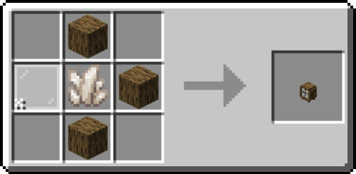

### Mantel Clock
A small round clock with a wide base.

  
Crafting Recipe's

  <h3>Mantel Clock Oak</h3>
  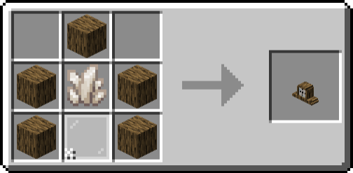

### Tall Mantel Clock
A skinny tall mantel clock that can be placed on top or on the side of a block.

  
Crafting Recipe's

  <h3>Tall Mantel Clock Oak</h3>
  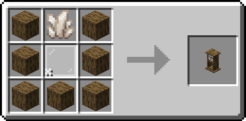

### Wall Clock
A flat clock that comes in three size options: small(1x1), medium(2x2), large(3x3).

  
Crafting Recipe's

  <h3>Wall Clock Small Oak</h3>
  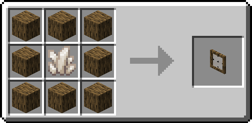
  <h3>Wall Clock Medium Oak</h3>
  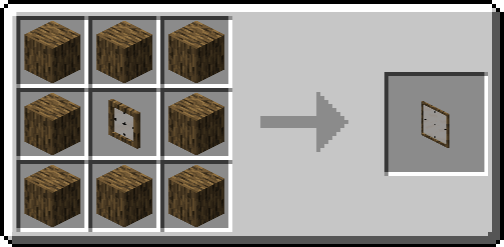
  <h3>Wall Clock Large Oak</h3>
  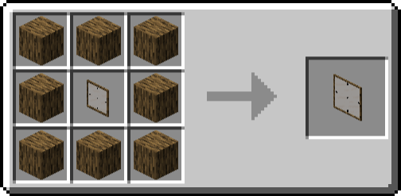

****

## Handbell
This item makes a chime sound when hitting entities and right-clicked. It can also be inserted into the Alarm Clock to allow it to chime at sunrise. The handle has ___ customization options and can be placed as a block similar to the vanilla bell. Chime pitch and swing speed are determined by bell material type 'weight', heavier metals will have a lower pitch.

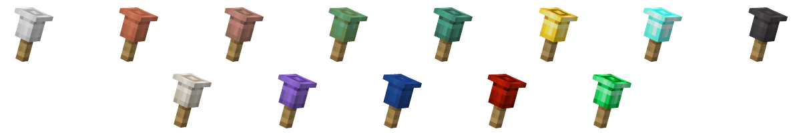

**Types:** Iron, Copper, Exposed Copper, Weathered Copper, Oxidized Copper, Gold, Diamond, Netherite, Quartz, Amethyst, Lapis Lazuli, Redstone, Emerald

  
Details

  <h3>Iron Handbell</h3>
  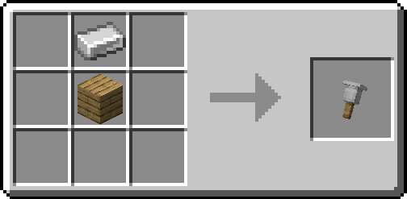
  <h3>Pitch</h3>
    - Full Pitch: Iron, Copper 
    - 3/4 Pitch: Exposed Copper, Gold, Emerald, Amethyst, Quartz, Lapis Lazuli, Redstone 
    - 1/2 Pitch: Weathered Copper, Diamond 
    - 1/4 Pitch: Oxidized Copper, Netherite
  <h3>Swing Speed</h3>
    - Full Speed: Iron, Copper 
    - 3/4 Speed: Exposed Copper, Gold, Emerald, Amethyst, Quartz, Lapis Lazuli, Redstone 
    - 1/2 Speed: Weathered Copper, Diamond 
    - 1/4 Speed: Oxidized Copper, Netherite

## Pocket Watch
A must-have for any adventurer with a keen sense of style, this handheld clock doubles as the power source for clocks.

**Types:** Iron, Copper, Exposed Copper, Weathered Copper, Oxidized Copper, Gold, Diamond, Netherite, Quartz, Amethyst, Lapis Lazuli, Redstone, Emerald

**Note:** Exposed, Weathered, and Oxidized Copper Pocket Watches cannot be crafted. They oxidize when placed in complete clocks and can be waxed to preserve the condition.

  
Crafting Recipe

  <h3>Iron Pocket Watch</h3>
  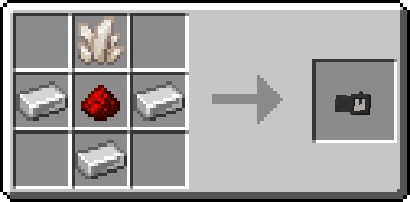

## Pendulum
When placed inside a valid clock the clock chime at noon and midnight. Pendulum swing speeds and chime pitch are determined by metal 'weight', heavier metals will have a lower pitch.

**Types:** Iron, Copper, Exposed Copper, Weathered Copper, Oxidized Copper, Gold, Diamond, Netherite, Quartz, Amethyst, Lapis Lazuli, Redstone, Emerald

**Note:** Exposed, Weathered, and Oxidized Copper Pendulums cannot be crafted. They oxidize when hanging in complete clocks and can be waxed to preserve the condition.

  
Details

  <h3>Swing Speed</h3>
    - Full Speed: Iron, Copper (all variants) 
    - 3/4 Speed: Gold, Emerald, Amethyst, Quartz, Lapis Lazuli, Redstone 
    - 1/2 Speed: Diamond 
    - 1/4 Speed: Netherite
  <h3>Pitch</h3>
    - Full Pitch: Iron, Copper (all variants) 
    - 3/4 Pitch: Gold, Emerald, Amethyst, Quartz, Lapis Lazuli, Redstone 
    - 1/2 Pitch: Diamond 
    - 1/4 Pitch: Netherite
  <h3>Iron Pendulum Crafting Recipe</h3>
  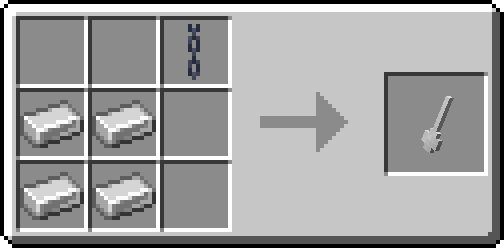

****